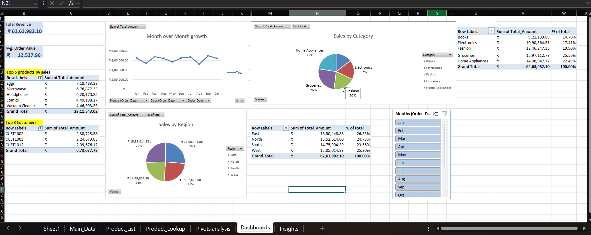

# Corporate Sales Performance & Revenue Attribution Analysis 📊

An end-to-end commercial sales analytics framework tracking ₹6.26M in revenue across multi-tiered regional markets, automated using Advanced Microsoft Excel (Dynamic Pivots, Nested INDEX-MATCH, XLOOKUP Automation) and backed by analytical SQL extraction pipelines.

🔗 **Live Workbook Access:** [Open Interactive Workbook (OneDrive / Excel Online)](https://onedrive.live.com/personal/7f2052812007e03a/_layouts/15/Doc.aspx?sourcedoc=%7B7B9994FF-51F8-43C2-8D52-60EB91E23F64%7D&file=corporate_sales_workbook.xlsx&action=default)  
*(Best viewed directly in Excel Online or Desktop for native interactive slicers, dynamic cross-filtering, and automatic recalculations)*

---

## Executive Dashboard Preview


---

## Key Business Findings & Strategic Takeaways
* **Revenue Baseline & Order Economics:** Reconciled and audited 500 multi-market commercial transactions establishing **₹6,263,982.10** in total portfolio revenue with an **Average Order Value (AOV)** baseline of **₹12,527.96**.
* **Seasonal Contraction & Recovery:** Pinpointed an operational slump in February (₹5.37L, -17.2% decline) followed by sustained quarter-on-quarter momentum peaking in September (₹6.98L), allowing inventory and marketing reallocations.
* **Category & Regional Attribution:** Groceries (₹15.97L, 25.50%) and Home Appliances (₹14.09L, 22.49%) led category revenue volume, while East (₹16.50L, 26.35%) and West (₹15.85L, 25.30%) proved to be the highest yielding regional territories.
* **Automated Product Modeling:** Implemented dynamic lookup architecture (`INDEX-MATCH` and `XLOOKUP`) linking transaction IDs to catalog unit pricing, eliminating static pricing errors.

---

## Multi-Sheet Workbook Architecture
```text
corporate_sales_workbook.xlsx
├── Main_Data           (500 Transaction Records, Unit Economics, Product IDs)
├── Dashboards          (Executive KPI Cards, Sales Trend Line, Category/Region Visuals, Slicer)
├── Pivots,analysis     (MoM Growth Rates, Regional Share, Top 5 Products, Top 3 Customers)
├── Product_List        (Catalog Matrix with INDEX-MATCH Dynamic Mapping)
├── Product_Lookup      (Dynamic Interactive Search Console)
└── Insights            (Strategic Commercial Takeaways & Recommendations)